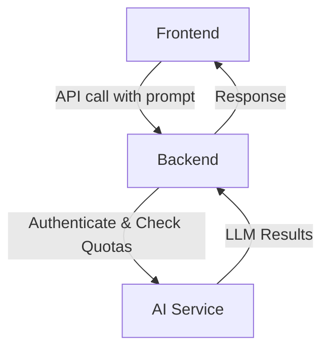

# Backend Architecture Overview for LLM Application

## 1. Introduction
### 1.1 Purpose of the Document
This document outlines the high-level architecture of the Backend (BE) for an LLM (Large Language Model) application. The application consists of three main repositories:
- **Backend (BE)**: Handles business logic, APIs, data integration, and communication with other components.
- **Frontend (FE)**: User interface, managing user interactions and API calls to the BE.
- **AI**: Manages LLM processing, including inference, training (if applicable), and AI-related services.

The backend serves as the central hub, connecting the FE to the AI, ensuring seamless data flow, security, and high performance. This document focuses on the overall design and does not delve into detailed code implementation.

### 1.2 Scope
- **Scope**: n compoHigh-level architecture of the BE, covering mainents, data flows, and technologies used.
- **Exclusions**: Detailed implementation of FE or AI, specific code, or detailed operational documentation.

### 1.3 Assumptions
- The LLM application uses models like GPT-series or similar, with inference via API (e.g., OpenAI API or self-hosted).
- The system supports end-users through the FE, with the BE acting as an intermediary.
- The architecture is designed as either microservices or monolithic based on scale, but a monolithic approach is assumed initially for simplicity, with potential to scale to microservices.

## 2. Architecture Overview
### 2.1 System Model
The system is divided into three main layers:
- **Frontend**: Sends user requests (e.g., LLM prompts) to the BE via APIs.
- **Backend**: Processes requests, handles authentication, stores data, calls AI services, and returns results.
- **AI**: Performs LLM inference, potentially hosted on a separate server (e.g., using Hugging Face Transformers or TensorFlow Serving).

**Basic Data Flow**:

**Architecture Diagram** (text-based, can be visualized using tools like Draw.io):

```mermaid
flowchart TD
    A[Frontend] --> B[HTTP/REST API]
    B --> C[Backend]
    B --> F[Database]
    C --> D[gRPC/HTTP]
    D --> E[AI Service (LLM Inference)]
    F-->B
```

### 2.2 Main Backend Components
- **API Layer**: Uses RESTful APIs to receive requests from the FE.
- **Business Logic Layer**: Handles processes like user session management, prompt preprocessing, and post-processing AI responses.
- **Integration Layer**: Connects to the AI repo (via API endpoints), database, and third-party services (e.g., OAuth authentication providers).
- **Data Storage Layer**: Stores user data, chat history, and metadata.
- **Monitoring & Logging**: Tracks performance and errors.

### 2.3 Data Flow and Interactions
- **Primary Flow (LLM Inference)**:
  - Receive prompt from FE.
  - Authenticate user (JWT or session).
  - Send prompt to AI service.
  - Receive response, store history if needed.
  - Return response to FE.
- **Secondary Flows**:
  - User Management: Register, login, profile.
  - Quota Management: Limit LLM requests per user.
  - Error Handling: Retry mechanism for failed AI service calls.

## 3. Technology Stack
### 3.1 Language and Framework
- **Language**: Python (with FastAPI/Flask).
- **Framework**: FastAPI for high performance and async support.

### 3.2 Database
- **SQL**: PostgreSQL for structured data (users, history).

### 3.3 Cache and Queue
- **Cache**: Redis for session storage and database load reduction.

### 3.4 AI Integration
- HTTP/gRPC calls to AI repo endpoints (e.g., /predict with payload {prompt: "..."}).
- Libraries: `requests` (Python) or `axios` (Node.js).

### 3.5 Security
- **Authentication**: JWT, OAuth2.
- **Authorization**: Role-based access (user/admin).
- **Data Protection**: HTTPS, input sanitization to prevent prompt injection.
- **Rate Limiting**: Restrict requests to prevent abuse.

### 3.6 Scalability & Performance
- **Horizontal Scaling**: Deploy multiple BE instances with a load balancer .
- **Containerization**: Docker for deployment.

## 4. Risks and Solutions
- **Risk**: High latency from AI inference → **Solution**: Async processing, caching common responses.
- **Risk**: Prompt security (sensitive data in prompts) → **Solution**: Encrypt data at rest.
- **Risk**: High LLM costs (if using cloud APIs) → **Solution**: Quota management, prompt optimization.

## 6. Deployment and CI/CD
- **Environments**: Dev, Staging, Prod.
- **CI/CD**: GitHub Actions or Jenkins – Build Docker images, deploy to AWS/EC2 or Heroku.
- **Versioning**: Semantic Versioning for the BE repo.

## 7. Related Documentation
- **API Details**: Swagger/OpenAPI specification.
- **AI Integration**: Contract description between BE and AI.
- **FE Documentation**: How to call APIs from FE.

This document may be updated based on requirement changes. For additional details or diagrams, please provide specific information about technologies or features.